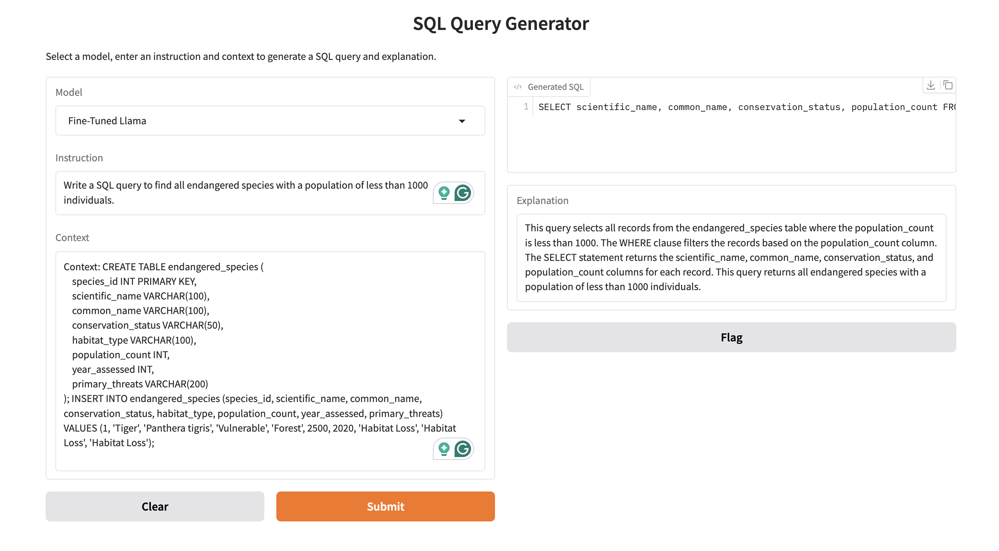

# Prompt-to-SQL LLM Fine-Tuning

This repository demonstrates the fine-tuning of two large language models (LLMs) — a **1B parameter LLaMA model** and a **1.5B parameter DeepSeek model** — for SQL query generation tasks. The models were fine-tuned using a specialized dataset designed for generating SQL queries based on natural language prompts. Additionally, the performance of both models was evaluated and compared based on their ability to generate accurate SQL queries.

## Overview

The goal of this project is to fine-tune pre-trained LLaMA and DeepSeek models on a SQL generation dataset, improving their ability to understand and generate SQL queries from natural language. Both models were trained on the same dataset and evaluated based on metrics such as accuracy, BLEU score, and execution correctness of generated queries.

## Key Features

- **Fine-Tuned Models**: 
  - Fine-tuning of **LLaMA (1B parameters)** on a SQL query generation task.
  - Fine-tuning of **DeepSeek (1.5B parameters)** on the same task for comparison.
  
- **SQL Generation Dataset**: 
  - A dataset of natural language prompts paired with SQL queries for training.
  
- **Model Comparison**: 
  - Performance metrics were collected to compare the accuracy and quality of SQL queries generated by both models.
  - A detailed evaluation of the models' capabilities to generate syntactically correct and efficient SQL queries.

- **Model Performance Evaluation**:
  - The models were evaluated on their ability to produce SQL queries that match the ground truth provided in the dataset.
  - The results were compared using metrics like BLEU score and execution correctness.

## Architecture

- **LLaMA** and **DeepSeek** were fine-tuned with custom SQL generation datasets.
- The models were trained on a cloud infrastructure with appropriate hardware accelerators (GPUs) to handle the large model size.
- **Evaluation** was carried out by comparing the generated queries against ground truth SQL queries for various benchmarks.

## Setup

### Prerequisites

- **Python 3.x**
- **PyTorch** (for model training and evaluation)
- **Transformers** library by Hugging Face
- **Gradio** (Used for visualization)

\
